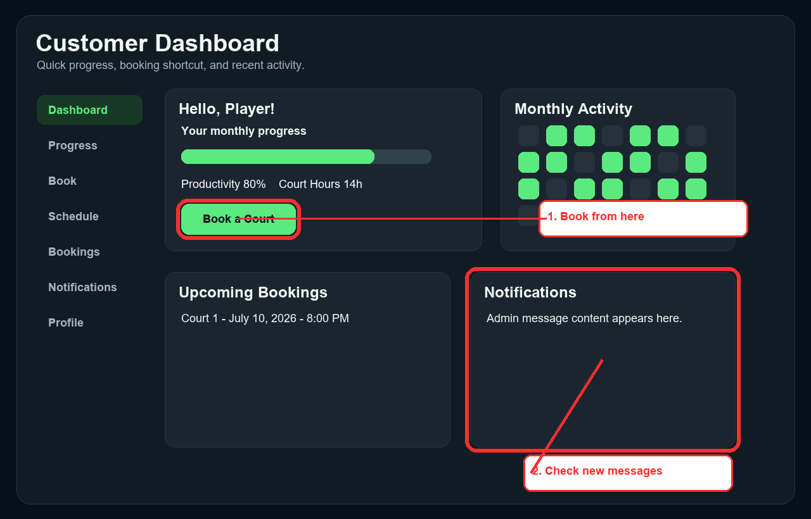
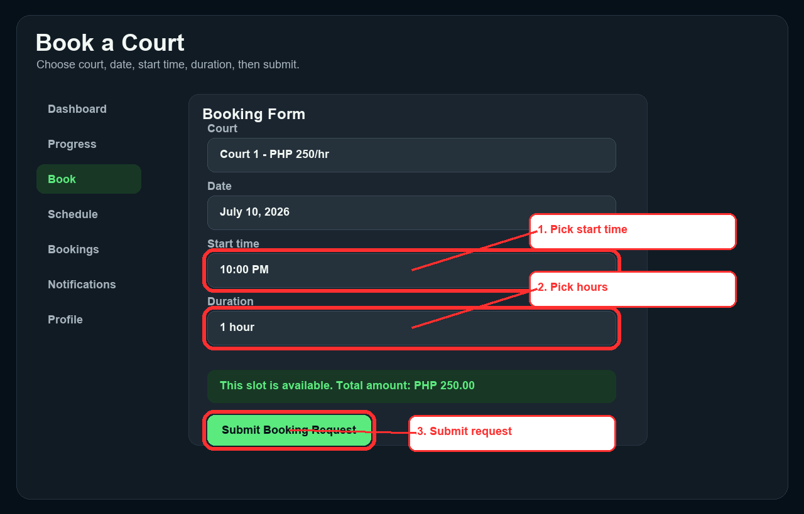
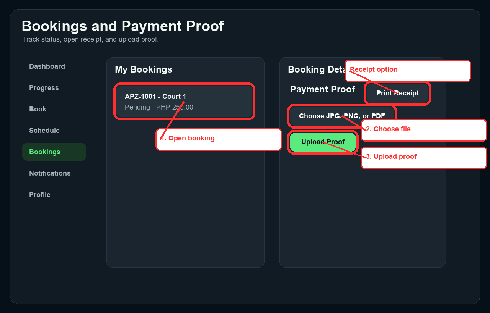
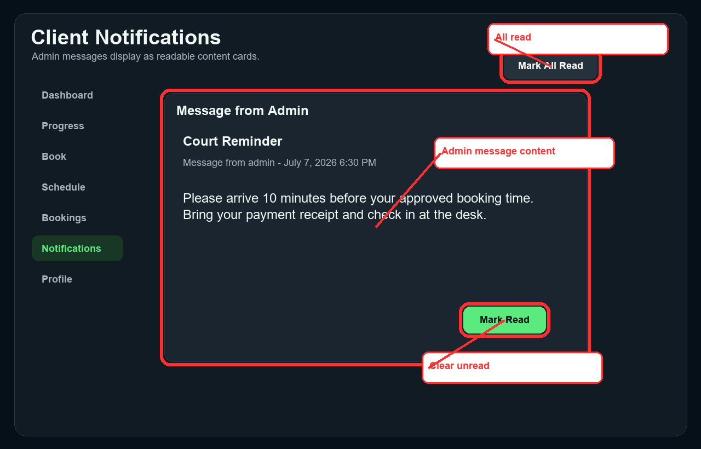
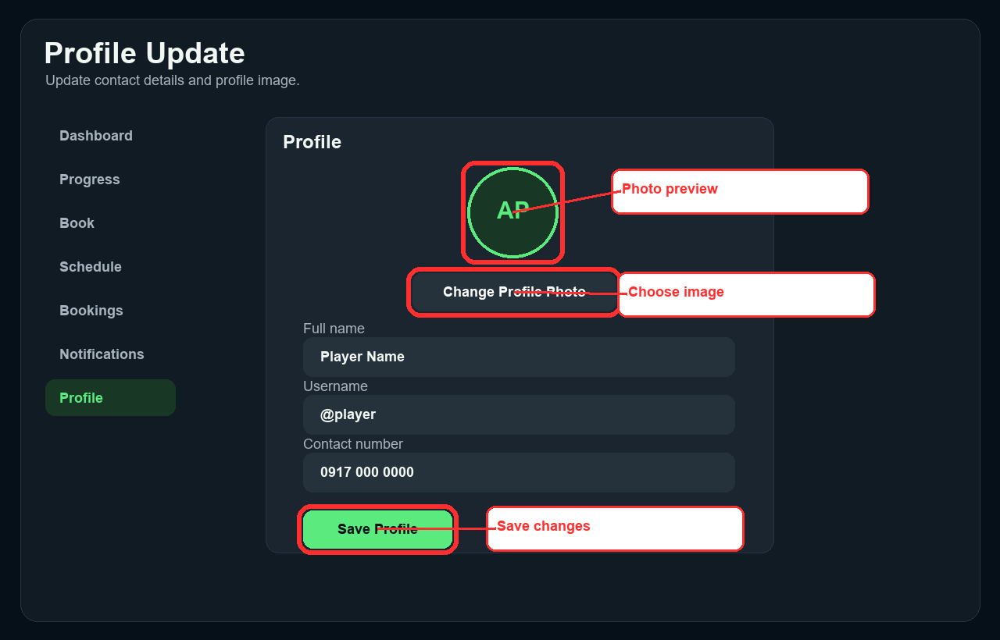
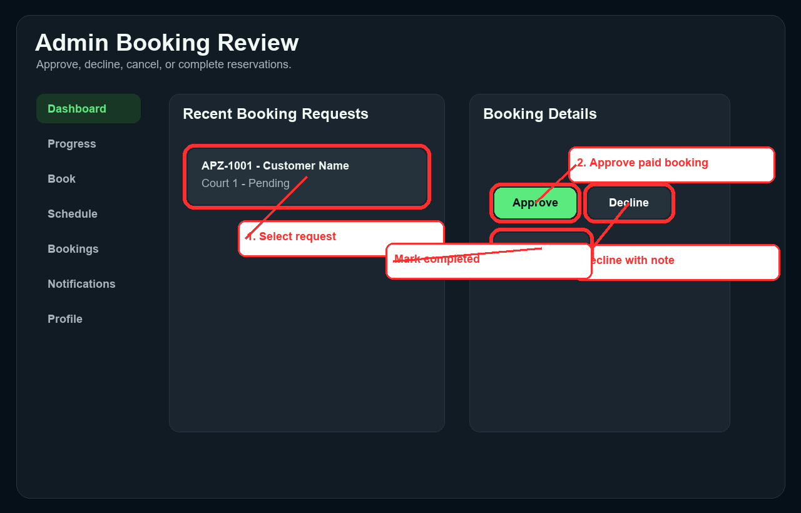
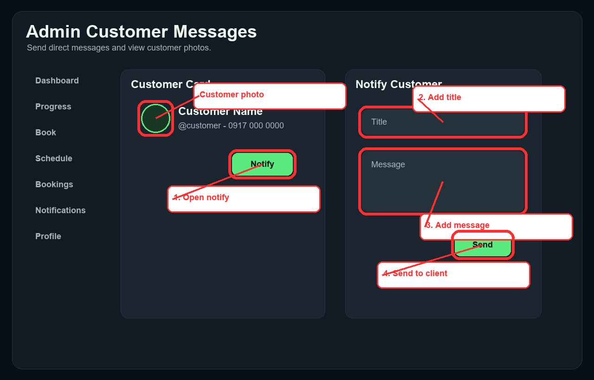
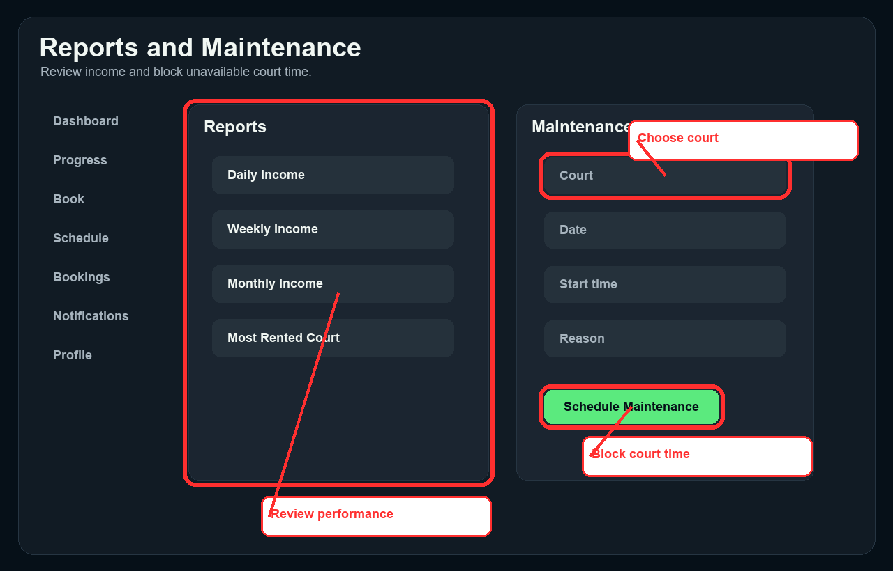

# Aps Pickle Zone User Guide

Version: 1.1

This guide is a step-by-step manual for customers, admins, and system owners. Red circles in the interface images show the exact button, field, or content area to use.

## 1. Overview

Aps Pickle Zone is a dynamic web app for pickleball court reservations and court operations. Customers can register, book courts, upload payment proof, track personal progress, receive notifications, and manage their profile. Admin users can approve bookings, manage courts, send customer notifications, track active rentals, review reports, and manage maintenance.

The app is designed as an installable web app. It can be opened in a browser and installed from supported browsers as a standalone app.

## 2. User Roles

### Customer

Customers can:

- Create an account and log in.
- Book available pickleball courts.
- Upload payment proof.
- Track booking status and receipts.
- View availability schedules.
- Receive booking and admin notifications.
- Track personal progress, court hours, streaks, and productivity.
- Update profile details and profile photo.
- View leaderboard rankings.

### Admin

Admins can:

- Review and approve or decline booking requests.
- Verify payment proof.
- Manage customer profiles.
- Send direct notifications to customers.
- View customer profile photos.
- Manage court availability and maintenance.
- Monitor active rentals with live countdowns.
- Review revenue reports and booking summaries.
- View activity logs.

## 3. Visual Step-by-Step Customer Guide

### Customer Dashboard



1. Select Book a Court to create a new reservation.
2. Check recent admin messages and booking updates in Notifications.
3. Use Dashboard and Progress to monitor court hours, streaks, and productivity.

### Book a Court



1. Select the court, date, start time, and duration.
2. Confirm the slot is available.
3. Select Submit Booking Request.

Booking rules:

- Court rate is PHP 250.00 per hour.
- Default maximum booking duration is 4 hours.
- Bookings can run up to 11:00 PM.
- Pending, approved, and active bookings block overlapping reservations.
- Maintenance blocks prevent booking affected courts.

### Bookings and Payment Proof



1. Open Bookings.
2. Select the booking row.
3. Choose a JPG, PNG, or PDF payment proof.
4. Select Upload Proof.
5. Use Print Receipt when the booking is billable.

Payment proof files must be 8 MB or smaller.

### Client Notifications



1. Open Notifications to view booking updates and admin messages.
2. Admin messages appear as full content cards.
3. Use Mark Read or Mark All Read to clear unread indicators.

### Profile Update



1. Open Profile.
2. Select Change Profile Photo to choose a JPG or PNG image.
3. Edit full name or contact number if needed.
4. Select Save Profile.

Profile photos must be 15 MB or smaller. The image preview updates immediately after selection and after saving.

## 4. Visual Step-by-Step Admin Guide

### Admin Booking Review



1. Open Bookings or select a recent request from the Admin Dashboard.
2. Review the booking details and payment proof.
3. Select Approve for valid paid bookings.
4. Select Decline or Cancel when needed and include an admin note.
5. Select Complete when the rental is finished.

### Customer Management and Direct Messages



1. Open Customers.
2. Review customer profile photos, contact details, bookings, and payments.
3. Select Notify.
4. Add a title and message.
5. Select Send.

The message appears in the customer's Notifications page as a full admin message card.

### Reports and Maintenance



1. Open Reports to review income, top renters, most rented court, and booking status summaries.
2. Open Maintenance to block court time for repairs or private events.
3. Select court, date, time, duration, and reason.
4. Select Schedule Maintenance.

Maintenance blocks prevent new bookings in the affected time range.

## 5. Accessing the App

1. Open the web app URL provided by the owner or deployment host.
2. Use the navigation menu to go to Login or Register.
3. On mobile, open the side menu from the app bar.
4. On supported browsers, install the app from the browser install prompt or menu.

## 6. Customer Reference

### Register an Account

1. Open Register.
2. Enter full name, username, contact number, and password.
3. Select Create Account.
4. After registration, log in using the username and password.

Usernames must use lowercase letters, numbers, dots, dashes, or underscores.

### Log In

1. Open Login.
2. Enter username and password.
3. Select Login.

If login fails, confirm the account exists and that Supabase email confirmation is disabled or the account has been confirmed by the owner.

### Track Bookings

Open Bookings to see:

- Booking reference.
- Court and date.
- Time range.
- Total amount.
- Payment status.
- Booking status.
- Receipt and print option when billable.

Statuses include Pending, Approved, Active, Completed, Cancelled, and Declined.

### View Court Availability

Open Schedule to view court availability by date. Green slots are open. Busy, maintenance, or closed slots cannot be booked.

### Personal Progress

Open Progress to track:

- Productivity score.
- Monthly court goal.
- Weekly and monthly hours.
- Active days.
- Current and best streaks.
- Completed sessions.
- Verified spend.
- Favorite court.

## 7. Admin Reference

### Admin Dashboard

The Admin Dashboard shows:

- Total customers.
- Pending booking requests.
- Approved bookings today.
- Active renters.
- Available courts.
- Total income.
- Recent booking requests.
- Active rental countdowns.
- Player of the Week.

### Court Management

Open Courts to:

- Set a court as Available.
- Mark a court for Maintenance.
- Mark a court as Inactive.
- Add maintenance or status notes.

### Active Rentals

Open Active to see live countdown timers for rentals currently in play. Timers update smoothly without requiring manual refresh.

### Activity Logs

Open Logs to review important admin actions.

## 8. Real-Time Behavior

The app uses Supabase Realtime for key data updates. Booking changes, notifications, court updates, maintenance changes, profile changes, and admin activity updates refresh quietly in the background.

The app also reduces unnecessary full-screen refreshes. Countdown timers update locally, while data changes are debounced to avoid repeated reloads.

## 9. Setup Notes for Owners

### Supabase Setup

Run the main schema in Supabase SQL Editor:

```sql
supabase/schema.sql
```

For existing installations, also run:

```sql
supabase/username_only_profiles_patch.sql
supabase/profile_image_bucket_limit_patch.sql
```

The profile image patch raises the private profile image bucket limit to 15 MB.

### Environment Variables

Set these values in the deployment host:

- SUPABASE_URL
- SUPABASE_ANON_KEY

For local IDE testing, these can also be set in:

```text
assets/config/supabase.json
```

### Build the Web App

Use:

```powershell
C:\flutter\bin\flutter.bat build web --release
```

Deploy the generated folder:

```text
build/web
```

Supported hosts include Vercel, Netlify, Firebase Hosting, and other static hosts.

## 10. Troubleshooting

### Profile Photo Does Not Upload

Confirm the file is JPG or PNG and 15 MB or smaller. For existing Supabase projects, run `supabase/profile_image_bucket_limit_patch.sql`.

### Booking Slot Is Not Available

Check if the court is already pending, approved, active, under maintenance, inactive, or outside allowed booking hours.

### Customer Does Not See Admin Message

Confirm the admin selected the correct customer and that the customer opens the Notifications page. The app refreshes notifications in real time, but the customer can also use Refresh if the connection was interrupted.

### Payment Proof Cannot Upload

Use JPG, PNG, or PDF only. The file must be 8 MB or smaller.

### First User Is Not Admin

Promote a user in Supabase SQL Editor:

```sql
update public.profiles
set role = 'admin'
where username = 'your_admin_username';
```

## 11. Recommended Client Handover Checklist

- Confirm Supabase URL and anon key are configured.
- Register one admin account.
- Register one test customer account.
- Create and approve a test booking.
- Upload payment proof.
- Upload a customer profile photo.
- Send an admin message to the customer.
- Confirm realtime notification display.
- Confirm web app installation from browser.
- Confirm reports and active timers work.
